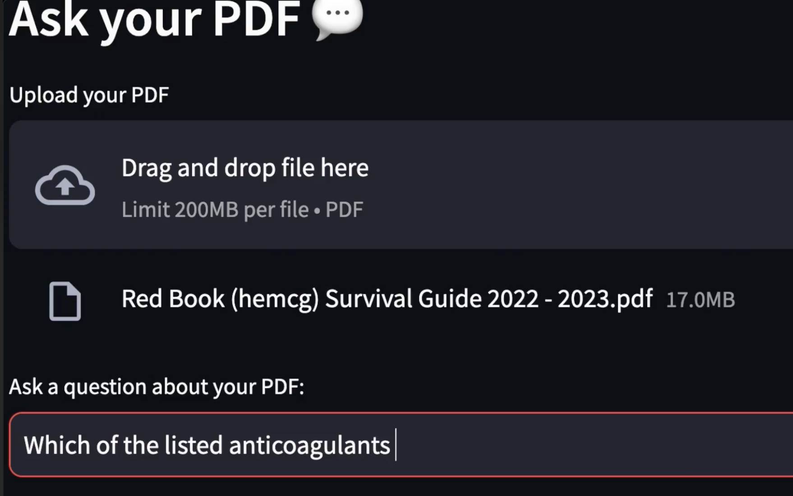

# ragchat
## Intro

 <!-- Adjust the width as needed -->


### A simple demo, using Retrieval Augmented Generation (RAG) and pdf utilities to create a chat interface one may use to ask questions of some laboratory documentation, protocols, or inventory data. (Some simple example data provided)

For more information, visit the [project page](https://path-math.com/projects/2023-ragchat/).

### Summary:              11/28/2023
    This is a document to test out simple knowledge retrieval from documents in simple cases. Also this is a first pass at langchain

    Notes:
    -In good working order 11/29/2023
    -Run in termainl with to view in browser localhost:8501 
    >>  streamlit run hello_rag_pdf.py

"""
## Examples 
For those without an API key, I kept a record of several [Q&A interactions](_results/_files/sample-qa.md) that are essentially representative. 


## Setup
An API key and account with [openai](https://www.openai.com)

#### Getting started:

One of the embedding models is only available through conda, so venv is not recommended. 

Recommended is to create an environment like so (using Anaconda or Miniconda):
```sh
conda create --name ragchat python=3.9
conda activate ragchat

Then install the dependencies defined in pyproject.toml:
```python
pip install -U pip
python -m pip install --editable .
```

This will make the /src/ragchat directory a toplevel import available to any project file.

Now get that annoying last conda-forge dependency. Those meeting the hardware and driver requirements (not covered here) one may use faiss-gpu instead

```sh
conda install -c conda-forge faiss-cpu
```
        > (Press y when prompted)

Finally run the streamlit app.

```bash
cd /src/ragchat
streamlit run pdfchat.py
```

Sample data to play with is in /src/data. 


<video controls loop autoplay src="_results/_files/sr-smear-contacts.mp4" title="Q: Who You Going to Call ?!"></video>

["Q: Who You Going to Call ?!"](_results/_files/sr-smear-contacts.webm)

<video controls loop autoplay src="_results/_files/sr-smear-contacts.mp4" title="Q: Who You Going to Call ?!"></video>

<video controls loop autoplay src="_results/_files/sr-argatroban.mp4" title="Q: Which Anticoagulants Have the Shortest Half-Life ?"></video>